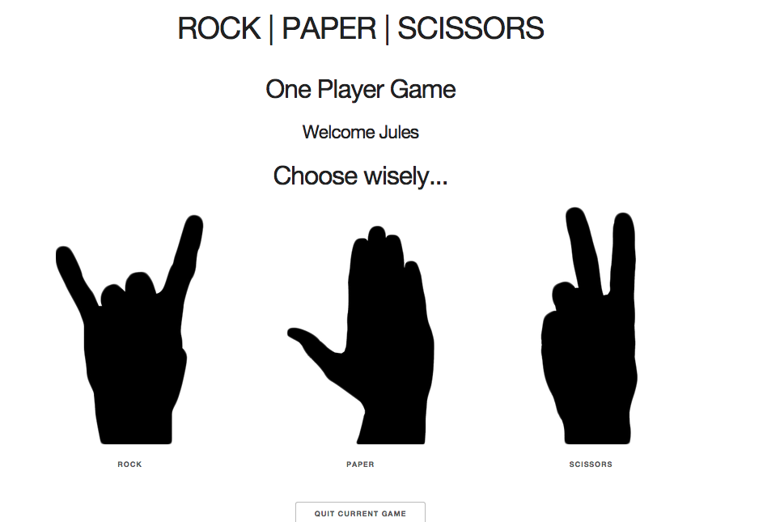

# Rock Paper Scissors

## Tech used

Ruby, Sinatra, WebSockets (Faye), CSS, JSON

## Lessons learned

I found that creating the one player version was relatively easy. However, not so for the two player - particularly with real time page updates in reponse to user input. Initially I used some HTML on the page to refresh if a condition is true, however wasn't particularly keen on that, so turned to polling using JQuery, which worked but seemed a little clunky so I thought I'd give web sockets a go. Unfortunately I have no idea at present how to test websockets. As things stand, the results using Faye are a little unpredictable. For instance if all the steps are followed in sequence it works fine, however everything will break if the one of the users does something unpredictable - and I have not figured out how best to rescue.

You can play the game on Heroku [here](https://jv-rps-challenge.herokuapp.com/two_player/game).

## Screenshot

# Challenge: Rōnin Badge Test

Knowing how to build web applications is getting us almost there as web developers!

The Makers Academy Marketing Array ( **MAMA** ) have asked us to provide a game for them. Their daily grind is pretty tough and they need time to steam a little.

Your task is to provide a _Rock, Paper, Scissors_ game for them so they can play on the web with the following features:

- the marketeer has to enter their name before the game
- the marketeer will be presented the choices (rock, paper and scissors)
- the marketeer can choose one option
- the game will choose a random option
- a winner will be declared

As always you can use google your notes and everything else. This is a challenge for you and you only! And you must submit a pull request to this repo with your challenge solution (or partial solution) by 9am Monday morning.

**Rōnin BANZAI!!!!**

## Bonus 1: Multiplayer

Change the game so that two marketeers can play against each other ( _yes there are two of them_ ).

## Bonus 2: Rock, Paper, Scissors, Spock, Lizard

Use the _special_ rules ( _you can find them here http://en.wikipedia.org/wiki/Rock-paper-scissors-lizard-Spock_ )

## Basic Rules

- Rock beats Scissors
- Scissors beats Paper
- Paper beats Rock
